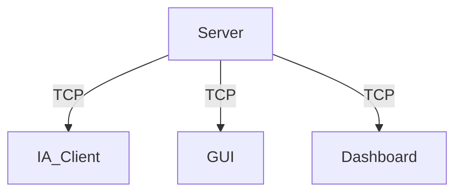

# Projet Zappy - Partie Serveur

## Introduction

Le projet Zappy est un jeu en réseau où plusieurs équipes s'affrontent sur une carte composée de cases contenant des ressources. Le serveur, codé en C, gère le monde du jeu, les interactions des joueurs, et la communication avec les interfaces graphiques (GUI) et les IA.

## Installation

### Prérequis

Le serveur Zappy utilise la bibliothèque `json-c` pour envoyer des informations au tableau de bord (dashboard). Vous devez installer cette bibliothèque avant de compiler le projet.

#### Debian/Ubuntu

```sh
sudo apt-get install libjson-c-dev
```

#### Fedora

```sh
sudo dnf install json-c-devel
```

### Compilation

Pour compiler le serveur, le GUI et les clients IA, exécutez la commande suivante à la racine du projet :

```sh
make
```

## Architecture

### Structure du Répertoire

```
.
├── Makefile
└── src
    ├── commands_gui
    │   ├── c_bct
    │   │   └── bct.c
    │   ├── c_ebo
    │   │   └── ebo.c
    │   ├── c_edi
    │   │   └── edi.c
    │   ├── c_enw
    │   │   └── enw.c
    │   ├── c_mct
    │   │   └── mct.c
    │   ├── c_msz
    │   │   └── msz.c
    │   ├── c_pbc
    │   │   └── pbc.c
    │   ├── c_pdi
    │   │   └── pdi.c
    │   ├── c_pdr
    │   │   └── pdr.c
    │   ├── c_pex
    │   │   └── pex.c
    │   ├── c_pfk
    │   │   └── pfk.c
    │   ├── c_pgt
    │   │   └── pgt.c
    │   ├── c_pic
    │   │   └── pic.c
    │   ├── c_pie
    │   │   └── pie.c
    │   ├── c_pin
    │   │   └── pin.c
    │   ├── c_plv
    │   │   └── plv.c
    │   ├── c_pnw
    │   │   └── pnw.c
    │   ├── c_ppo
    │   │   └── ppo.c
    │   ├── c_sbp
    │   │   └── sbp.c
    │   ├── c_seg
    │   │   └── seg.c
    │   ├── c_sgt
    │   │   └── sgt.c
    │   ├── c_smg
    │   │   └── smg.c
    │   ├── c_sst
    │   │   └── sst.c
    │   ├── c_suc
    │   │   └── suc.c
    │   └── c_tna
    │       └── tna.c
    ├── commands_ia
    │   ├── c_broadcast_txt
    │   │   └── broadcast_txt.c
    │   ├── c_connect_nbr
    │   │   └── connect_nbr.c
    │   ├── c_eject
    │   │   └── eject.c
    │   ├── c_fork
    │   │   └── fork.c
    │   ├── c_forward
    │   │   ├── forward.c
    │   │   └── moove.c
    │   ├── c_incantation
    │   │   ├── incantation.c
    │   │   └── start_incantation.c
    │   ├── c_inventory
    │   │   └── inventory.c
    │   ├── c_left
    │   │   └── left.c
    │   ├── c_look
    │   │   ├── gestion_coor.c
    │   │   ├── gestion_first_coor.c
    │   │   ├── gestion_str.c
    │   │   └── look.c
    │   ├── c_right
    │   │   └── right.c
    │   ├── c_set_obj
    │   │   └── set_obj.c
    │   └── c_take_obj
    │       └── take_obj.c
    ├── dashboard
    │   ├── get_usage.c
    │   └── send_info.c
    ├── init
    │   ├── generator
    │   │   ├── display_map.c
    │   │   ├── generator_map.c
    │   │   └── init_map.c
    │   └── init_struct.c
    ├── main.c
    ├── parsing
    │   ├── error.c
    │   └── parsing.c
    ├── run_commands
    │   ├── run_commands_dashboard.c
    │   ├── run_commands_gui.c
    │   └── run_commands_ia.c
    ├── server
    │   ├── config.c
    │   ├── handle.c
    │   ├── handle_cmd.c
    │   ├── init.c
    │   ├── server.c
    │   └── server_usage.c
    └── utils
        ├── commands
        │   ├── add_command.c
        │   ├── get_command.c
        │   ├── get_tick_for_command.c
        │   ├── print_command.c
        │   └── remove_command.c
        ├── elevation
        │   ├── add_elevation.c
        │   ├── get_elevation.c
        │   ├── init_elevation.c
        │   └── print_elevation.c
        ├── error.c
        ├── garbage_collector.c
        ├── get_rsc_code.c
        ├── init.c
        ├── map.c
        ├── my_strdup.c
        ├── players
        │   ├── create_player.c
        │   ├── display_player.c
        │   ├── get_player.c
        │   └── remove_player.c
        ├── progress_incantation
        │   ├── add_progress_incantation.c
        │   ├── get_progress_incantation.c
        │   └── remove_progress_incantation.c
        ├── refill.c
        ├── signal.c
        ├── split_buffer.c
        ├── team
        │   ├── add_team.c
        │   ├── create_team.c
        │   ├── egg_team.c
        │   └── get_team.c
        ├── tick.c
        └── tiredness.c
```

### Description des Composants

- **commands_gui** : Contient les commandes spécifiques pour l'interface graphique (GUI).
- **commands_ia** : Contient les commandes spécifiques pour les clients IA.
- **dashboard** : Contient les fichiers pour envoyer des informations de débogage et de performance au tableau de bord.
- **init** : Contient les fichiers pour initialiser les structures et la carte du jeu.
- **main.c** : Point d'entrée principal du serveur.
- **parsing** : Contient les fichiers pour analyser les arguments en ligne de commande.
- **run_commands** : Contient les fichiers pour exécuter les commandes reçues des clients GUI et IA.
- **server** : Contient les fichiers pour gérer les configurations et le fonctionnement du serveur.
- **utils** : Contient des fichiers utilitaires pour diverses fonctions telles que la gestion des joueurs, des équipes, des incantations, et des commandes.

### Schéma de Communication



Le serveur communique avec les clients IA, le GUI et le dashboard en utilisant des sockets TCP. Les clients IA envoient des commandes pour interagir avec le jeu, le GUI reçoit des mises à jour en temps réel sur l'état du jeu, et le dashboard reçoit des informations de débogage et des statistiques de performance.

## Structures Principales

### Structure `struct_t`

La structure principale `struct_t` contient tous les éléments nécessaires à la gestion du serveur et du jeu. Elle regroupe les informations sur les joueurs, les équipes, la carte, les commandes en cours, et bien plus encore. Voici une description détaillée de ses composants :

- **Paramètres généraux** : Informations sur le port, la taille de la carte, le nombre de clients, etc.
- **État du jeu** : Indicate

urs de démarrage/arrêt du serveur, état actuel du jeu.
- **Carte** : Structure de données représentant la carte du jeu, avec les ressources disponibles.
- **Joueurs et équipes** : Listes chaînées contenant les informations sur les joueurs et les équipes.
- **Incantations** : Informations sur les incantations en cours.
- **Dashboard** : Informations sur les performances et l'utilisation des ressources du serveur.

### Autres Structures

- **player_t** : Représente un joueur dans le jeu, contenant ses ressources, son état, et ses commandes en cours.
- **team_t** : Représente une équipe dans le jeu, contenant les informations sur les joueurs de l'équipe et les positions des œufs.
- **map_element_t** : Représente une case de la carte, contenant les ressources présentes et les joueurs sur la case.
- **incantation_t** : Représente une incantation en cours, contenant les IDs des joueurs impliqués et la position de l'incantation.
- **dashboard_t** : Représente les informations du tableau de bord, telles que l'utilisation du CPU et de la RAM.

## Communication du Serveur

### Communication avec les IA

La communication entre le serveur et les IA se fait via des sockets TCP. Voici un exemple de séquence de communication :

1. **Connexion de l'IA** :
   - L'IA ouvre une socket sur le port du serveur.
   - Le serveur envoie un message de bienvenue.
   - L'IA envoie le nom de l'équipe.
   - Le serveur envoie le numéro de client et les dimensions du monde.

2. **Envoi de commandes** :
   - L'IA peut envoyer jusqu'à 10 commandes sans attendre de réponse.
   - Le serveur exécute les commandes dans l'ordre de réception et envoie des réponses de confirmation.

### Communication avec le GUI

Le GUI utilise le même protocole de communication que les IA, mais il s'authentifie en tant que GUI en envoyant le nom d'équipe "GRAPHIC". Le GUI reçoit des mises à jour en temps réel sur l'état du jeu, les positions des joueurs, et les ressources.

### Communication avec le Dashboard

Le dashboard est un bonus qui permet d'envoyer des informations de debug et de performance. Le serveur utilise la bibliothèque `json-c` pour formater les données en JSON et les envoyer au dashboard. Les informations envoyées incluent l'état de la carte, les joueurs, les équipes, et des statistiques de performance telles que l'utilisation du CPU et de la RAM.

## Lancer le Serveur

Pour lancer le serveur, utilisez la commande suivante en spécifiant les options nécessaires :

```sh
./zappy_server -p port -x width -y height -n team1 team2 ... -c clientsNb -f freq
```

### Options

- `-p port` : Numéro de port pour le serveur.
- `-x width` : Largeur de la carte.
- `-y height` : Hauteur de la carte.
- `-n team1 team2 ...` : Noms des équipes.
- `-c clientsNb` : Nombre de clients autorisés par équipe.
- `-f freq` : Fréquence des unités de temps pour l'exécution des actions.

Par exemple, pour lancer un serveur sur le port 8080 avec une carte de 10x10, deux équipes ("Team1" et "Team2"), 3 clients par équipe, et une fréquence de 100 :

```sh
./zappy_server -p 8080 -x 10 -y 10 -n Team1 Team2 -c 3 -f 100
```

## Conclusion

Cette documentation couvre l'architecture du serveur Zappy, les structures principales utilisées, et les protocoles de communication avec le GUI, les IA et le dashboard. Le serveur est conçu pour gérer efficacement les connexions multiples et les interactions complexes entre les joueurs et les différentes interfaces, tout en assurant un suivi précis des ressources et des commandes.
